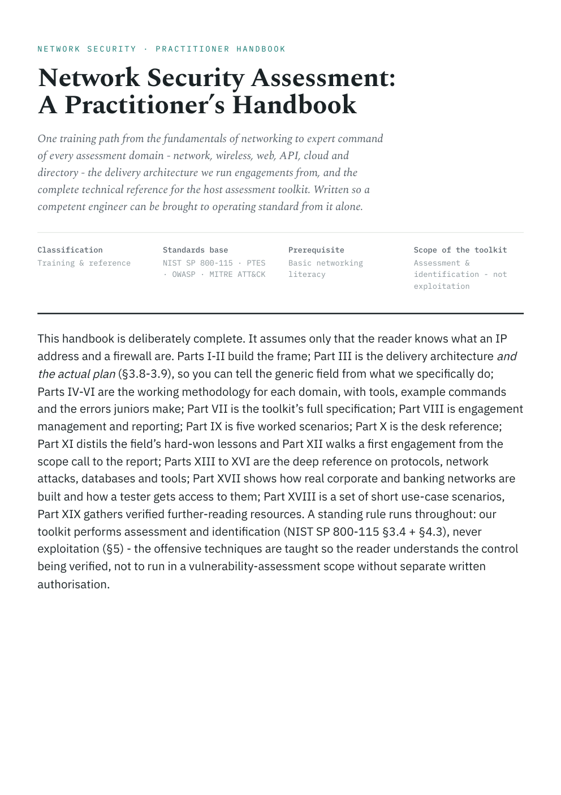

# Network Security Assessment: A Practitioner's Handbook

  

  
  &nbsp;
  

**A practical reference across network, wireless, web, API, cloud and directory assessment.**
It assumes basic familiarity with IP addresses and firewalls, and introduces methodology, tools, example
commands, the errors juniors make, and the deeper reference on protocols, attacks, databases and how
real corporate and banking networks are actually built.

## Read it

Three ways, pick one:

1. **[Read online](https://abdullahzarshaid.github.io/network-security-assessment-handbook/handbook.html)**: the full handbook as a website, with a clickable contents panel, section links and a light or dark theme. Every part in the table below is a direct link.
2. **[Download the PDF](https://github.com/abdullahzarshaid/network-security-assessment-handbook/raw/main/Network-Security-Assessment-Handbook.pdf)** (138 pages): bookmarked, with a clickable table of contents, for offline reading and printing.
3. **[Download `handbook.html`](https://github.com/abdullahzarshaid/network-security-assessment-handbook/raw/main/handbook.html)** and open it in any browser for offline browsing with the same navigation as the website.

## Who it's for

Junior testers and blue-teamers who want to become genuinely competent without piecing it together
from scattered blogs; students moving from theory to practice; and anyone who wants one coherent,
standards-based reference for network security assessment.

## What's inside (19 parts, each link opens that part online)

| Part | Topic |
|---|---|
| I | [Foundations of networking](https://abdullahzarshaid.github.io/network-security-assessment-handbook/handbook.html#p1) |
| II | [Assessment, standards and the engagement lifecycle](https://abdullahzarshaid.github.io/network-security-assessment-handbook/handbook.html#p2) |
| III | [Delivery architecture: where you test from](https://abdullahzarshaid.github.io/network-security-assessment-handbook/handbook.html#p3) |
| IV | [Network penetration testing](https://abdullahzarshaid.github.io/network-security-assessment-handbook/handbook.html#p4) |
| V | [Wireless assessment](https://abdullahzarshaid.github.io/network-security-assessment-handbook/handbook.html#p5) |
| VI | [Web, API and cloud assessment](https://abdullahzarshaid.github.io/network-security-assessment-handbook/handbook.html#p6) |
| VII | [The host assessment toolkit: full specification](https://abdullahzarshaid.github.io/network-security-assessment-handbook/handbook.html#p7) |
| VIII | [Engagement management](https://abdullahzarshaid.github.io/network-security-assessment-handbook/handbook.html#p8) |
| IX | [Worked scenarios](https://abdullahzarshaid.github.io/network-security-assessment-handbook/handbook.html#p10) |
| X | [Desk reference](https://abdullahzarshaid.github.io/network-security-assessment-handbook/handbook.html#p11) |
| XI | [Lessons from the field](https://abdullahzarshaid.github.io/network-security-assessment-handbook/handbook.html#p12) |
| XII | [A first engagement, walked through](https://abdullahzarshaid.github.io/network-security-assessment-handbook/handbook.html#p13) |
| XIII | [Protocols in depth: the language of the wire](https://abdullahzarshaid.github.io/network-security-assessment-handbook/handbook.html#p14) |
| XIV | [Network attacks and vulnerabilities: the catalogue](https://abdullahzarshaid.github.io/network-security-assessment-handbook/handbook.html#p15) |
| XV | [Databases on the network](https://abdullahzarshaid.github.io/network-security-assessment-handbook/handbook.html#p16) |
| XVI | [Tools in depth: what to run, and when](https://abdullahzarshaid.github.io/network-security-assessment-handbook/handbook.html#p17) |
| XVII | [How real client networks are built, and how you get in](https://abdullahzarshaid.github.io/network-security-assessment-handbook/handbook.html#p18) |
| XVIII | [Use cases and mini-scenarios](https://abdullahzarshaid.github.io/network-security-assessment-handbook/handbook.html#p19) |
| XIX | [Resources and further reading](https://abdullahzarshaid.github.io/network-security-assessment-handbook/handbook.html#p20) |

Grounded in **NIST SP 800-115, PTES, OWASP and MITRE ATT&CK**, with links to primary sources
throughout.

## Scope and ethics

This handbook is about **assessment and identification, not exploitation.** Offensive techniques are
explained so you understand the control being verified, never to run outside a scope you are
authorised, in writing, to test. Learning to attack is how you learn to defend; keep it legal.

## License

The handbook text and figures are released under
**[Creative Commons Attribution 4.0 (CC BY 4.0)](LICENSE)**: you are free to share and adapt it,
including commercially, as long as you give credit. Author: **Abdullah Bin Zarshaid**.

If it helped you, a star helps other learners find it.
